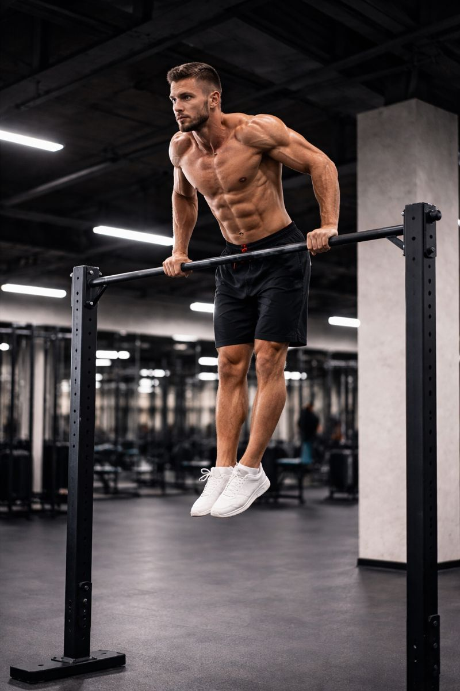
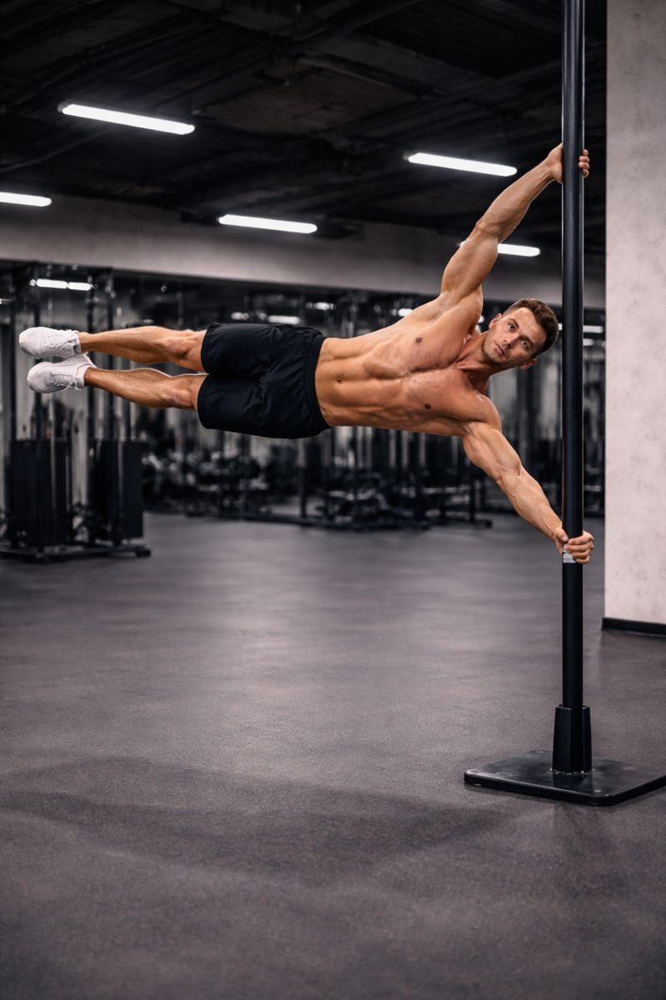
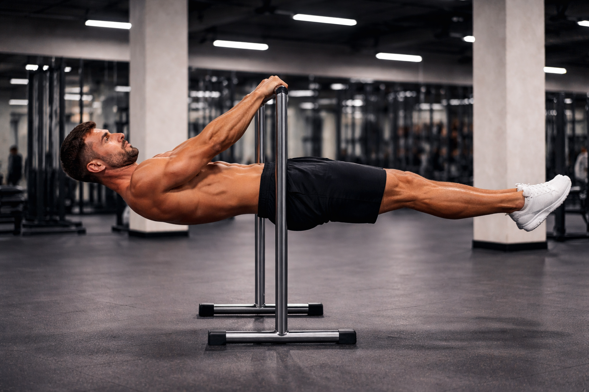
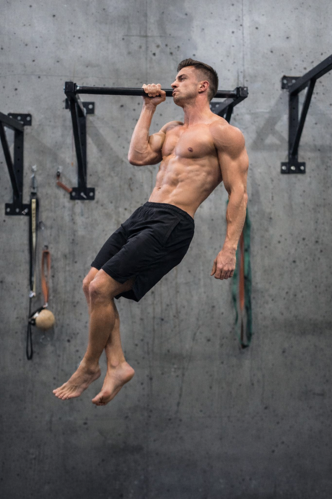
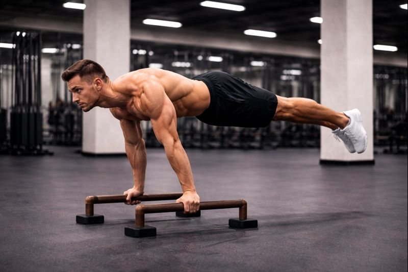

# 引言

在街头健身（Street Workout）与自重训练体系中，有一些动作被反复提及、反复挑战，并最终成为训练者能力层级的“分水岭”。

它们并不一定是最花哨的，但几乎无一例外地具备以下特征：

- 极高的 **力量密度**
- 明确的 **进阶路径**
- 对 **关节稳定性与长期训练规划** 提出要求
- 一旦完成，具有极强的 **视觉与能力象征意义**

本文选取了五个最具代表性的自重技能动作，从**力量要求、关节风险与整体难度**等角度进行系统分析，帮助你：

- 判断自己**目前适合挑战哪一类技能**
- 理解为什么某些动作“看起来简单，却极难完成”
- 避免因进阶过快而导致的训练停滞或伤病

⚠️ 需要强调的是：  
⭐ 星级并非“谁更厉害”的绝对排名，而是综合考虑 **力量要求、身体控制、关节耐受与长期训练成本** 后的相对评估。

---

# 五大技能对比表

| 技能 | 难度 | 主要力量要求 | 关节风险 | 视觉震撼 |
| --- | --- | --- | --- | --- |
| **双力臂** | ⭐⭐⭐☆ | ⭐⭐⭐☆ | ⭐⭐⭐ | ⭐⭐⭐ |
| **顺风旗** | ⭐⭐⭐⭐☆ | ⭐⭐⭐⭐ | ⭐⭐⭐⭐ | ⭐⭐⭐⭐⭐ |
| **前水平** | ⭐⭐⭐⭐☆ | ⭐⭐⭐⭐ | ⭐⭐⭐⭐ | ⭐⭐⭐⭐ |
| **单臂引体** | ⭐⭐⭐⭐⭐ | ⭐⭐⭐⭐⭐ | ⭐⭐⭐⭐⭐ | ⭐⭐⭐⭐ |
| **俄式挺身** | ⭐⭐⭐⭐⭐ | ⭐⭐⭐⭐⭐ | ⭐⭐⭐⭐⭐ | ⭐⭐⭐⭐⭐ |

---

# 1. 双力臂（Muscle Up）

⭐⭐⭐☆ 中级动作 ｜3–12 个月（视基础而定）

## 🎯 动作简介

双力臂是街头健身中最具代表性的复合爆发动作之一。训练者需从死悬状态出发，通过高爆发引体向上将身体拉至胸部甚至腹部高度，在身体前倾的同时完成从「拉」到「推」的动力学转换，最终稳定支撑于单杠之上。

它并非简单的“引体 + 撑体”，而是一个以**爆发拉力为主导、技巧协同完成的高速过渡动作**。

---

## ⚠️ 训练难点分析

**① 爆发拉力（⭐⭐⭐⭐☆）**  
需要在极短时间内输出远高于体重的拉力，这是大多数训练者的主要瓶颈。

**② 拉 → 推的动力学转换（⭐⭐⭐⭐）**  
过杠阶段要求身体前倾、肘部快速下沉，任何时机错误都可能导致“卡肘”或失败。

**③ 控制与关节耐受（⭐⭐⭐⭐）**  
肩与肘在高速过渡中承受显著剪切力，必须循序渐进适应。

---

## ✅ 前置能力建议

**力量基础**
- 严格引体向上：8–10 个
- 爆发引体：胸部稳定过杠
- 双杠撑体：10–15 个

**专项准备**
- 高位引体（拉至下胸 / 腹部）
- 负重引体（+10–20% 体重）
- 弹力带或低杠辅助双力臂

⚠️ 不建议初学者将假握作为主要练习方式。

---

# 2. 顺风旗（Human Flag）

⭐⭐⭐⭐☆ 高级 ｜18–36 个月（个体差异显著）

## 🎯 动作简介

顺风旗是典型的侧向悬空静力动作。训练者通过上下手臂的推拉配合，使身体在侧向平面内保持接近水平的“旗帜”姿态。

本质上，它是一个**极端杠杆条件下的侧向等长抗屈动作**。

---

## ⚠️ 训练难点分析

**① 综合力量要求（⭐⭐⭐⭐）**  
下侧拉力、上侧推力与侧核心抗屈能力缺一不可。

**② 稳定性容错率极低（⭐⭐⭐⭐）**  
身体排列的微小偏差都会被长杠杆无限放大。

**③ 关节耐受风险（⭐⭐⭐⭐）**  
肩、肘、腰椎长期承受不对称负载，必须通过角度进阶逐步适应。

---

## ✅ 前置能力建议

- 单臂悬挂：≥ 30 秒 / 侧
- 侧平板支撑：60–90 秒 / 侧
- 弹力带或低角度顺风旗进阶训练

---

# 3. 前水平（Front Lever）

⭐⭐⭐⭐☆ 高级 ｜12–24 个月

## 🎯 动作简介

前水平是经典的直臂静力拉力动作。训练者需在悬挂状态下，将身体控制至完全水平，并维持从肩到脚的整体刚性。

它是一个**长杠杆条件下的直臂等长抗伸展动作**。

---

## ⚠️ 训练难点分析

**① 等长力量输出（⭐⭐⭐⭐☆）**  
难点不在于“拉起来”，而在于**在不弯臂的前提下持续对抗巨大力矩**。

**② 稳定与身体排列（⭐⭐⭐⭐）**  
肩胛下沉 + 前伸、骨盆中立、全身张力缺一不可。

**③ 关节耐受（⭐⭐⭐⭐）**  
肩前部与肘部是最常见的不适部位。

---

## ✅ 推荐进阶路径

Tuck → Advanced Tuck → One Leg → Straddle → Full  
每阶段建议稳定 ≥ 10 秒后再进阶。

---

# 4. 单臂引体向上（One Arm Pull Up）

⭐⭐⭐⭐⭐ 专家级 ｜18–36 个月

## 🎯 动作简介

单臂引体是单侧拉力能力的巅峰测试。训练者需在单臂条件下完成完整引体，并控制身体旋转与摆动。

---

## ⚠️ 训练难点分析

**① 单侧极限拉力（⭐⭐⭐⭐⭐）**  
一侧手臂需承受接近全身体重的负荷。

**② 抗旋转与路径控制（⭐⭐⭐⭐）**  
允许旋转，但必须是“可控的旋转”。

**③ 不对称风险（⭐⭐⭐⭐⭐）**  
左右发展失衡是最常见的长期隐患。

---

## ✅ 前置能力建议

- 引体向上：15–20 个
- 负重引体：+15–30% 体重
- 弓箭手引体、离心单臂引体

---

# 5. 俄式挺身（Planche）

⭐⭐⭐⭐⭐ 终极难度 ｜24–48 个月+

## 🎯 动作简介

俄式挺身是对推力、核心张力与关节耐受要求最高的自重静力动作之一。训练者仅以双手支撑，在直臂状态下将身体完全悬空。

---

## ⚠️ 训练难点分析

**① 极端杠杆下的推力输出（⭐⭐⭐⭐⭐）**  
难点在于“保持不动”，而非推起。

**② 重心与张力控制（⭐⭐⭐⭐）**  
任何细微偏移都会导致失败。

**③ 长期关节代价（⭐⭐⭐⭐⭐）**  
手腕、肘、肩是限制进度的核心因素。

---

## ✅ 进阶路径建议

Frog → Tuck → Advanced Tuck → Straddle → Full  
⚠️ 每阶段可能需要 6–12 个月甚至更久。

---

**结语**  
这些技能并非“必须完成”，但它们能清晰暴露你的力量结构、关节短板与训练思维。  
如果你能在长期、无伤的前提下稳步接近它们，本身就已经说明了极高的训练水平。

# 📋 通用训练建议（强烈建议完整阅读）

### 1️⃣ 进阶原则：稳定优先于时间
请不要以“训练了多久”作为进阶标准。  
**唯一可靠的进阶信号是：**
- 能在良好动作质量下  
- 稳定完成目标动作 **≥ 2–3 组**
- 且连续 2–3 周无明显关节不适

⚠️ 如果某个阶段“偶尔能做到”，但重复性很差，说明尚未准备好进阶。

---

### 2️⃣ 训练顺序只是参考，不是必须路线
推荐顺序：
**双力臂 → 前水平 → 顺风旗 → 单臂引体 → 俄式挺身**

但请注意：
- 拉类技能（前水平 / 单臂引体）之间会相互干扰
- 推类技能（俄式挺身）应尽量与高强度拉力训练错开
- 同一周期内**不建议同时主攻 2 个以上高难度技能**

👉 更合理的做法是：
**1 个主技能 + 1 个低强度辅助技能**

---

### 3️⃣ 单次训练量：宁少勿多（这是最重要的一条）
对于高难度技能训练：

- **静力动作（Front Lever / Planche）**
  - 每次有效尝试：**3–6 组**
  - 单组保持：5–12 秒
  - 明显失败或动作变形即停止

- **爆发或极限动作（Muscle Up / OAP）**
  - 高质量重复：**总计 5–15 次以内**
  - 避免“力竭式刷次数”

⚠️ 技能训练不是刷容量。  
**当动作质量下降时，继续训练只是在积累伤病风险。**

---

### 4️⃣ 训练频率：给关节留恢复空间
- 高强度技能训练：**每周 2–3 次**
- 同一技能间隔：**至少 48–72 小时**
- 若出现以下情况，应主动降量或休息：
  - 肘、肩出现钝痛或“发紧”
  - 热身时力量明显下降
  - 技能完成度连续几次训练下滑

👉 能“按计划休息”，是长期训练者的重要能力。

---

### 5️⃣ 热身与关节准备不是可选项
建议结构：
- **一般热身**：5–10 分钟（心率上升）
- **专项激活**：肩胛、直臂控制、核心张力
- **关节准备**：手腕 / 肘 / 肩（尤其是 Planche 与 Flag）

训练后拉伸可做，但**恢复睡眠与训练间隔更重要**。

---

### 6️⃣ 避免过度训练的底线原则
以下任一情况出现，请立即减量或暂停专项技能：

- 同一关节连续 3 次训练出现不适
- 需要“心理强迫”才能开始训练
- 热身后仍感觉身体“不愿意发力”
- 技能水平在疲劳状态下被反复尝试

❗ **技能是长期工程，不是状态好的当天完成的。**

---

### 7️⃣ 重复次数 ≠ 进步速度
对技能训练而言：
- **更少、更干净的重复**
- 比更多、但变形的尝试
- 对神经系统和关节更友好

如果你能在一次训练中：
- 提前结束
- 并在下一次状态更好地回来  
那说明你的训练是成功的。

---

### 8️⃣ 最后一句重要提醒
这些技能的真正难点，并不是力量本身，  
而是 **在数月甚至数年内，持续不过度、不受伤地训练下去**。

能做到这一点的人，最终几乎都会完成目标。
