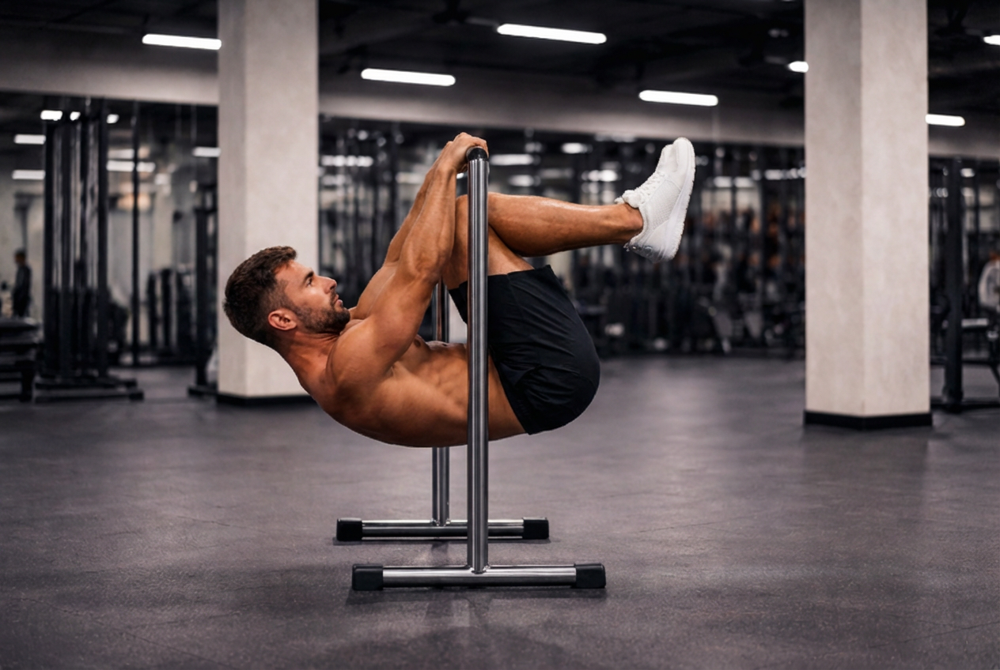
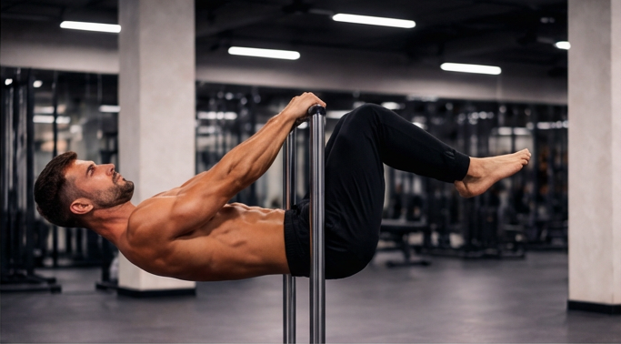
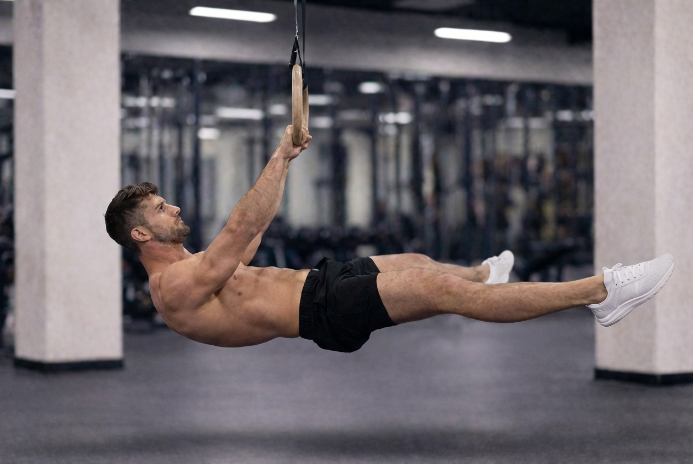

# 前水平训练指南（Front Lever Guide）

> 本指南假设你已经了解前水平的定义、难度等级和基本进阶路径，
> 本文将只关注一件事：**如何把它练出来，并且不受伤。**

---

## 使用前说明

前水平不是一个“练会就结束”的动作，而是一个对力量、稳定性与关节耐受要求极高的长期项目。

请在开始之前确认：
- 你可以严格完成 ≥ 10 个引体向上
- 肩部在悬挂和直臂负荷下无明显疼痛
- 你接受「进步以月为单位」这一现实

如果以上任一条件不满足，建议先回到基础阶段。

---

## 前水平的真实限制因素（非常重要）

绝大多数人失败，并不是因为：
- 背阔肌不够强
- 核心不够硬

而是因为以下三点：

### 1️⃣ 直臂等长力量不足
前水平几乎没有“拉”的过程，本质是：
> 在极长杠杆下维持直臂等长收缩

很多能负重引体的人，依然无法稳定前水平。

---

### 2️⃣ 肩胛控制错误
常见误区：
- 过度后缩肩胛 → 肩前压力巨大
- 完全放松肩胛 → 身体塌陷

前水平需要的是：
**肩胛下沉 + 轻度前伸的稳定状态**

---

### 3️⃣ 进阶过快导致关节先崩
力量提升速度 > 关节适应速度
这是前水平训练中最危险的结构性问题。

---

## 训练总体原则

请在整个训练周期中反复确认以下原则：

- **稳定优先于角度**
- **动作质量优先于时间**
- **能重复完成 > 偶尔成功**
- **不失败，本身就是进步**

如果某一次训练中你反复失败，这次训练已经结束。

---

## 进阶阶段划分与训练建议

### 阶段 1：屈膝前水平（Tuck Front Lever）



**进阶标准**

* 3 组 × ≥10 秒
* 姿态稳定
* 训练后无肘或肩不适

**训练建议**

* 3–5 组
* 每组 8–12 秒
* 组间休息 90–120 秒

---

### 阶段 2：高级屈膝（Advanced Tuck）



这是最容易卡住的阶段。

⚠️ 停滞 4–6 周属于正常结构适应期。

**进阶标准**

* 3 组 × ≥10 秒
* 无骨盆补偿
* 次日无明显关节僵硬

**训练量**

* 4–5 组
* 每组 6–10 秒

---

### 阶段 3：单腿 / 分腿前水平




**建议**

* 只选一种变式
* 不同时混练

**训练量**

* 3–5 组
* 5–8 秒稳定保持

---

### 阶段 4：完整前水平（Full Front Lever）

现实目标：

* 首次成功：3 秒
* 稳定目标：3 组 × 5–8 秒

不要以“单次极限”为目标。

---

## 单次训练结构建议（模板）

```text
热身（10–15 分钟）
↓
前水平主训练（10–20 分钟）
↓
辅助训练（直臂下拉 / 核心）
↓
结束
```

## 前水平的发力机制解析

前水平（Front Lever）并不是一个“拉起身体”的动作，而是一个在极端杠杆条件下的**直臂等长抗伸展动作**。

在整个保持过程中：
- 肘关节几乎不发生屈伸
- 肩关节角度基本固定
- 主要负荷来自**持续的等长收缩**

因此，前水平更接近于「悬挂式平板支撑」，而非引体向上。

---

## 主要参与肌群与作用方式

### 1️⃣ 背阔肌（Latissimus Dorsi）——主动力肌

- **作用方式**：等长收缩
- **功能**：
  - 维持肩关节前屈角度
  - 对抗身体重量产生的前屈力矩

⚠️ 常见误区：
- 试图“用力拉”，导致肘屈曲、肩过度后缩
- 将前水平误练成“慢速引体”

---

### 2️⃣ 肩胛稳定肌群——动作成败关键

主要包括：
- 下斜方肌
- 前锯肌
- 菱形肌（辅助）

**理想状态：**
- 肩胛下沉 + 轻度前伸
- 稳定但不僵死

**错误状态：**
- 过度后缩 → 肩前压力显著增加
- 完全放松 → 身体塌陷、力矩骤增

---

### 3️⃣ 核心肌群——张力传导者，而非主力

涉及肌群：
- 腹直肌
- 腹横肌
- 髋屈肌群（骨盆稳定）

**主要作用：**
- 防止骨盆前倾或屈髋
- 保持躯干整体刚性

⚠️ 一旦核心先崩，背阔肌与肩部负荷会急剧上升。

---

### 4️⃣ 肘关节与前臂肌群——被动承重结构

涉及：
- 肱二头肌长头
- 肱肌
- 前臂屈肌群

在前水平中：
- 并非主要发力肌
- 但需要承受持续等长张力

这是肘部不适和肌腱炎高发的重要原因。

---

## 发力顺序与身体张力传导

高质量前水平的张力传导路径应为：

```text
手 → 前臂 → 肩胛稳定 → 背阔肌
        ↓
       核心整体刚性
        ↓
       骨盆 → 下肢
````

常见张力断点：

* 肩胛失稳
* 骨盆屈髋
* 直臂张力中断

一旦出现断点，局部关节负荷会骤增。

---

## 高风险受伤部位与原因分析

### 1️⃣ 肘关节（最常见）

**主要原因：**

* 直臂等长负荷时间过长
* 单次训练失败次数过多
* 缺乏离心与恢复训练

**预警信号：**

* 肘内侧或外侧钝痛
* 训练后僵硬感持续超过 24 小时

---

### 2️⃣ 肩前部（次常见）

**主要原因：**

* 肩胛长期处于过度后缩
* 进阶过快，关节尚未完成适应
* 训练量与恢复时间不匹配

**预警信号：**

* 肩前束刺痛或压迫感
* 热身后仍感觉“顶着”或不稳定

---

### 3️⃣ 腰椎（少见但风险高）

**主要原因：**

* 核心控制不足
* 过度追求角度导致塌腰

---

## 恢复与休息周期建议

### 无疼痛状态下的常规恢复

* 前水平专项训练：每周 **2–3 次**
* 同一专项训练间隔：**48–72 小时**
* 单次有效训练组数：**3–6 组**

---

### 出现轻微不适时（早期干预）

* 暂停前水平专项 **5–10 天**
* 保留：

  * 肩胛控制训练
  * 低强度直臂下拉
* 避免所有失败尝试与极限保持

---

### 出现持续疼痛时

* 停止专项训练 **2–4 周**
* 仅进行无痛范围内的基础拉力与康复训练
* 若 2 周内无明显改善，建议进行专业评估

⚠️ 带疼训练不会加快适应，只会延长恢复周期。

---

## 疼痛出现时的处理原则

请遵循以下顺序处理：

1. **优先停止专项动作，而不是硬降难度继续练**
2. 保留无痛动作，维持基础能力
3. 完全无不适后，回退 1 个进阶阶段重新开始

---

## 小结

前水平的本质不是“拉力展示”，而是：

* 长杠杆
* 直臂
* 等长收缩
* 高张力
* 慢适应

真正完成前水平的人，往往不是训练最狠的，
而是**最能控制训练冲动、尊重恢复节奏的人**。
